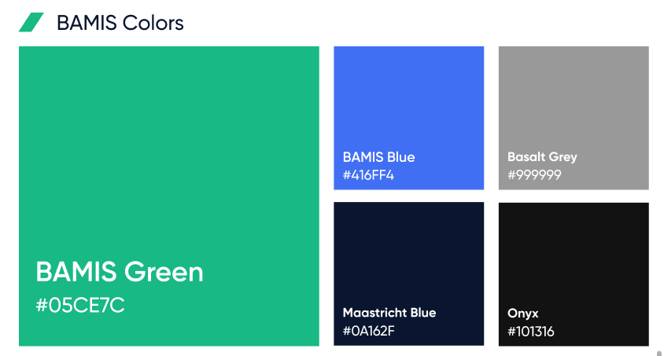

# LOGO

-  __#47BA7A__


-  __#416FF4__


-  __#0D152E__


--------

# COLOR



 __Green__
- #05CE7C

 __Blue__
- #416FF4

 __Basalt Grey__
- #999999

__Maastricht Blue__
- #0A162F

__Onyx__
- #101316

---------------

# Typography

## Gilroy
Typefamily

### Gilroy Extra Medium

-----------

# Iconography

```html 
<link rel="stylesheet" href="https://cdnjs.cloudflare.com/ajax/libs/bootstrap-icons/1.8.0/font/bootstrap-icons.min.css" integrity="sha512-H4E1ASW8Ru1Npd1wQPB7JClskV8Nv1FG/bXK6TWMD+U9YMlR+VWUZp7SaIbBVBV/iRtefsIsv9dLSN6fdUI36w==" crossorigin="anonymous" referrerpolicy="no-referrer" />

```
`https://icons.getbootstrap.com/`

-----------

# OTHER STUFF
https://placeholder.com/
https://via.placeholder.com/150x100
https://via.placeholder.com/728x90.png?text=Visit+WhoIsHostingThis.com+Buyers+Guide

https://via.placeholder.com/150/0000FF/808080

https://undraw.co/illustrations

https://www.manypixels.co/gallery

https://screenlane.com/screens/all/elements/audio-player/